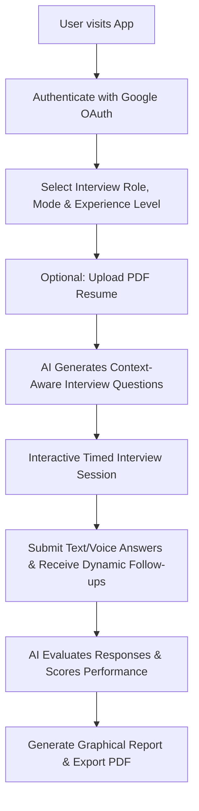

# 🤖 AI Interview Agent (InterviewIQ.AI)

> **An AI-powered smart mock interview platform that simulates real-world technical and HR interviews, evaluates voice and text responses, parses resumes, and generates comprehensive PDF feedback reports.**

[](https://ai-interview-agent-delta.vercel.app)
[](https://react.dev/)
[](https://nodejs.org/)
[](https://expressjs.com/)
[](https://www.mongodb.com/)
[](https://tailwindcss.com/)

---

## 🌐 Live Application

- **Frontend Deployment**: [https://ai-interview-agent-delta.vercel.app](https://ai-interview-agent-delta.vercel.app)
- **Backend API Deployment**: `https://ai-interview-agent-api.onrender.com`

---

## 🌟 Key Features

- 🎯 **Role & Experience Adaptation**: Customizable interviews tailored for specific job titles (e.g., Full Stack Engineer, Frontend Developer, Data Scientist) and experience levels (Fresher, Intermediate, Senior).
- 📄 **Resume Parsing (PDF Support)**: Upload candidate resumes to dynamically extract skills, projects, and work experience for highly personalized interview questions.
- 🎙️ **Smart Voice & Speech Interview**: Live voice question reading and speech recognition support to emulate authentic interview pressure.
- 🔄 **Dynamic AI Follow-Up Questions**: Adaptive question generation based on candidate answers in real time via LLM intelligence (OpenRouter / Gemini / Claude).
- ⏱️ **Timed Pressure Simulation**: Built-in interactive countdown timers to simulate high-stakes interview conditions.
- 📊 **Detailed Evaluation & Instant PDF Reports**: Deep scoring on technical accuracy, communication skills, and confidence, with instant downloadable PDF summary reports (`jsPDF`).
- 💳 **Credit & Payment Integration**: Razorpay payment gateway integration for topping up interview session credits.
- 🔐 **Secure Google OAuth & Cross-Domain Sessions**: Google Sign-In with Firebase Auth and HTTP-Only JWT session cookies across Vercel & Render hosts.

---

## 🛠️ Architecture & Tech Stack

### Frontend (`/client`)
- **Core Framework**: React 19 + Vite
- **State Management**: Redux Toolkit (`@reduxjs/toolkit`, `react-redux`)
- **Styling & UI**: Tailwind CSS v4, Motion (`motion/react`), React Icons (`react-icons`)
- **Auth & Services**: Firebase Web SDK v12, Axios
- **Visualization & PDF**: Recharts (analytics graphs), `jsPDF`, `jspdf-autotable`, `react-circular-progressbar`

### Backend (`/server`)
- **Runtime**: Node.js (ES Modules)
- **Framework**: Express.js 5
- **Database**: MongoDB Atlas with Mongoose ODM
- **AI Integration**: OpenRouter API (`axios` call to LLMs)
- **File Processing**: Multer, `pdfjs-dist` (PDF text extraction)
- **Auth & Payments**: JSON Web Tokens (`jsonwebtoken`), Cookie Parser, Razorpay SDK

---

## 🔄 How System Works (Application Workflow)



1. **Authentication**: Users log in using Google OAuth via Firebase. Authentication state is synchronized with MongoDB and secured with JWT tokens.
2. **Setup**: The candidate selects job role, interview mode (Technical or HR), experience level, and optionally uploads a PDF resume.
3. **Question Generation**: The server extracts text from the resume (using `pdfjs-dist`) and sends prompt context to OpenRouter AI to produce structured, tailored questions.
4. **Interview Execution**: Questions are presented sequentially with real-time timers and speech synthesis. Candidate answers are submitted back to the API.
5. **Report & Feedback**: The LLM evaluates all answers, generating scores (out of 100) for Technical Skills, Communication, and Confidence, along with key strengths, weaknesses, and model answers.

---

## 🚀 Getting Started (Local Setup)

### Prerequisites

Ensure you have the following installed on your machine:
- **Node.js** (v18.0.0 or higher)
- **npm** (v9.0.0 or higher)
- **MongoDB** (Local instance or MongoDB Atlas account)

---

### Step 1: Clone the Repository

```bash
git clone https://github.com/icedoutchirag/ai-interview-agent.git
cd ai-interview-agent
```

---

### Step 2: Configure Environment Variables

#### Backend (`/server/.env`)
Create a `.env` file in the `server/` directory:

```env
PORT=8000
MONGODB_URL=mongodb://127.0.0.1:27017/interview_db
JWT_SECRET=your_jwt_secret_key
OPENROUTER_API_KEY=sk-or-v1-your_openrouter_key
RAZORPAY_KEY_ID=rzp_test_your_razorpay_key_id
RAZORPAY_KEY_SECRET=your_razorpay_key_secret
CLIENT_URL=http://localhost:5173
```

#### Frontend (`/client/.env`)
Create a `.env` file in the `client/` directory:

```env
VITE_FIREBASE_APIKEY=your_firebase_web_api_key
VITE_RAZORPAY_KEY_ID=rzp_test_your_razorpay_key_id
VITE_BACKEND_URL=http://localhost:8000
```

---

### Step 3: Install Dependencies & Run

#### Run Backend Server
```bash
cd server
npm install
npm run dev
```
> Server running on: `http://localhost:8000`

#### Run Frontend Client (New Terminal)
```bash
cd client
npm install
npm run dev
```
> Client running on: `http://localhost:5173`

---

## 📡 API Endpoints Reference

### 🔐 Authentication Routes (`/api/auth`)
| Method | Endpoint | Description |
| :--- | :--- | :--- |
| `POST` | `/api/auth/google` | Google sign-in / signup via Firebase token |
| `GET` | `/api/auth/logout` | Clear user JWT cookie and log out |

### 👤 User Routes (`/api/user`)
| Method | Endpoint | Description |
| :--- | :--- | :--- |
| `GET` | `/api/user/current-user` | Fetch active logged-in user profile & credits |

### 🎯 Interview Routes (`/api/interview`)
| Method | Endpoint | Description |
| :--- | :--- | :--- |
| `POST` | `/api/interview/resume` | Upload & parse candidate resume PDF |
| `POST` | `/api/interview/generate-questions` | Generate tailored interview questions using AI |
| `POST` | `/api/interview/submit-answer` | Submit answer & receive dynamic follow-up question |
| `POST` | `/api/interview/finish` | Finalize interview & trigger evaluation report generation |
| `GET` | `/api/interview/report/:id` | Fetch full report data by interview ID |
| `GET` | `/api/interview/get-interview` | Retrieve all past interview sessions for user |

### 💳 Payment Routes (`/api/payment`)
| Method | Endpoint | Description |
| :--- | :--- | :--- |
| `POST` | `/api/payment/order` | Create Razorpay credit purchase order |
| `POST` | `/api/payment/verify` | Verify payment signature and add credits to user account |

---

## 📁 Repository Structure

```
AI Interview Agent/
├── client/                     # React Frontend App (Vite)
│   ├── public/                 # Static assets
│   ├── src/
│   │   ├── assets/             # Images, illustrations, audio/video assets
│   │   ├── components/         # Reusable UI components (Navbar, Timer, Step1, Step2, Step3)
│   │   ├── pages/              # App pages (Home, Auth, InterviewPage, History, Pricing, Report)
│   │   ├── redux/              # Redux slices & store setup
│   │   ├── utils/              # Firebase SDK initialization
│   │   ├── App.jsx             # Main router configuration
│   │   └── main.jsx            # Entry point
│   ├── index.html
│   ├── vite.config.js          # Vite config
│   └── package.json
│
└── server/                     # Express Node.js Backend API
    ├── config/                 # MongoDB & Token configuration
    ├── controllers/            # Controller logic (Auth, User, Interview, Payment)
    ├── middlewares/            # Authentication & File Upload middlewares
    ├── models/                 # Mongoose Data Models (User, Interview)
    ├── routes/                 # Express API Routes
    ├── services/               # OpenRouter AI integration service
    ├── index.js                # Server entry point
    └── package.json
```

---

## 📄 License

Distributed under the **ISC License**. See `LICENSE` for more details.

---

<p center>
  Developed with ❤️ by <a href="https://github.com/icedoutchirag">Chirag</a>
</p>
